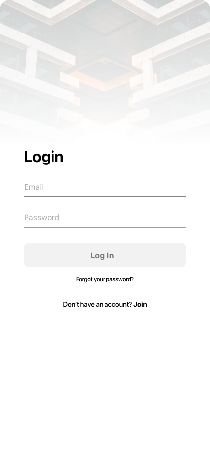
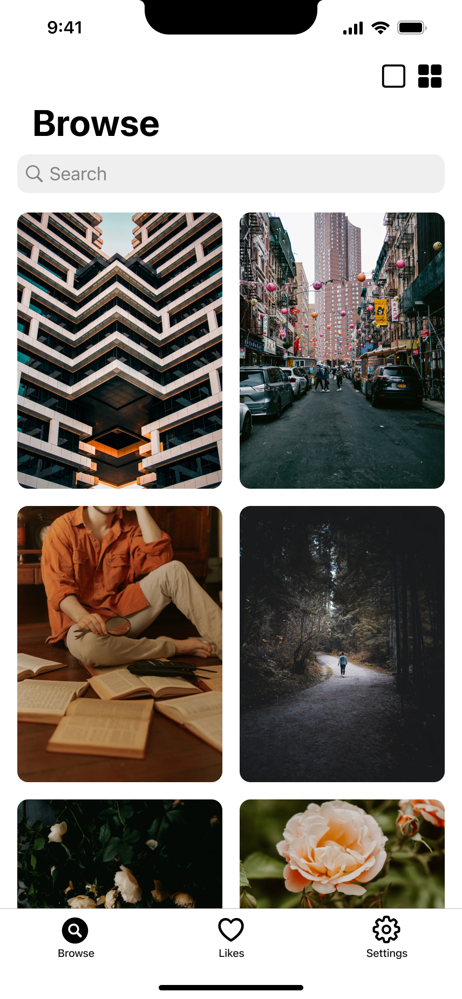
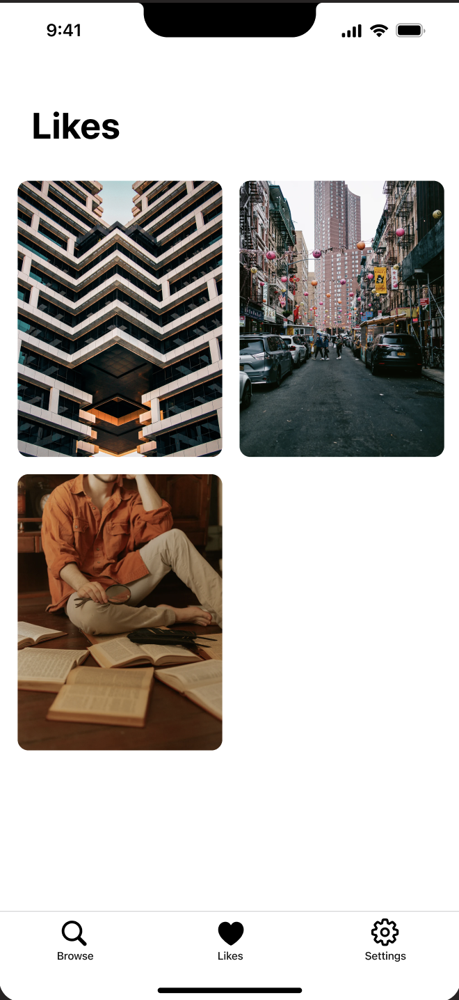

# Introduction to Unsplash

The Unsplash App is an iOS application that provides a seamless way for users to browse, discover, and save high-quality images sourced from the Unsplash API. By logging in or signing up, individuals gain personalized access to their own favorites collection, enabling them to curate a gallery of photographs that resonate with their interests—much like a simplified Pinterest experience.Important Note: Both Sign In and Sign Up will be mocked (i.e., no real backend). We’ll simulate user authentication without involving a real server, allowing us to focus on the structure and flow of the app.This project aims to familiarize you with core iOS development principles, such as UIKit components, modern architectural patterns (MVVM), data persistence (Core Data), and networking best practices, all while ensuring a modular structure through separate Swift packages.

## Planned Features

### 1. Authentication:

- **Sign Up:** Collect user details to create a new account (mocked, no actual backend calls).
- **Log In:** Securely authenticate and retrieve user-specific data (liked images, preferences), using simulated credentials.

{:.resize-img}

{:.resize-img}

{:.resize-img}

### 2. Image Feed with Pagination:

- **Unsplash API Integration:** Perform RESTful requests to retrieve and paginate high-resolution images.
- **Lazy Loading:** Fetch additional images as the user scrolls, ensuring smooth performance and efficient memory usage.

{:.resize-img}

{:.resize-img}

### 3. Image Detail View

- **Metadata Display:** Show photographer’s name and resolution details.
- **Like/Unlike Actions:** Toggle image state to either liked or not liked.

{:.resize-img}

### 4. Favorites (Liked Images) with Core Data

- **Local Persistence:** Store liked images and relevant metadata (IDs, URLs, etc.).
- **Offline Availability:** Maintain a local copy of liked images for quick reference when offline or in low-connectivity environments.

{:.resize-img}

**Architecture & Technologies**

1. **UIKit (Using XIBs):**
    - Illustrate key UIKit patterns, including UIViewController management, UITableView/UICollectionView for lists, and UINavigationController flows.
    - We’ll create .xib files for our custom views or table/collection view cells to keep a clean separation of UI elements.
2. **MVVM (Model–View–ViewModel):**
    - **Separation of Concerns:** Keep business logic in ViewModels, the UI in ViewControllers, and data models distinct.
    - **Observables:** Implement a system for data binding, ensuring that changes in data automatically update the UI.
3. **Swift Packages:**
    - **Networking Package:** Handles all API calls, including building request URLs, parsing JSON responses, and handling errors.
    - **UI Components Package:** Encapsulates reusable views (e.g., custom cells, loading spinners, image display components).
    - **Core Data Manager Package:** Contains logic for creating, reading, updating, and deleting data within the local Core Data store.
    - **Feature Packages:** Each major feature—such as authentication, image feed, and favorites—lives in its own package, enhancing modularity and maintainability.
    - **Main App (Constructor):** Serves as a lightweight “conductor” that assembles the packages, forming the final product.
4. **Core Data:**
    - **Data Model:** Defines the entities for user info (if needed) and liked images, including attributes like imageID, imageURL, and any relevant metadata.
5. **Networking & Concurrency:**
    - **RESTful API Consumption:** The Unsplash API endpoints will be used to load images and fetch details.
    - **Threading:** Operations to fetch data may need to run off the main thread to keep the UI responsive.

**Development Roadmap & Related Trainings**

Below is the revised roadmap for the first few weeks of the internship, reflecting our updated plan:

1. **App Architecture & Working with Packages**
    - **Git Training:** (Ongoing) Learn how to initialize a repository, commit changes, create branches, and manage pull requests alongside setting up the project.
    - **Setting Up the Base Project:** Initialize the Xcode workspace to integrate all these packages effectively.
    - **Overview of Swift Packages:** Learn how to structure the project into multiple packages (Networking, UI Components, Core Data Manager, etc.).
2. **UIKit Fundamentals**
    - **Hands-On UI Work with XIBs:** Create basic screens, set up navigation flows, and practice standard UIKit components.
    - **Working with View Controllers:** Understanding UITableView, UICollectionView, and UIViewController life cycles.
3. **MVVM & Observables**
    - **Implementing the MVVM Pattern:** Migrate existing UI logic into ViewModels to separate concerns.
    - **Data Binding with Observables (e.g., Combine or custom bindings):** Update UI automatically in response to data changes.
4. **Unit Testing Basics**
    - **Writing Tests for ViewModels & Networking:** Ensure each feature is properly tested.
    - **Mocking & Dependency Injection:** Create mock data sources for the networking and Core Data layers.
5. **UIKit Navigation**
    - **Navigation Controller Deep Dive:** Push, pop, and modal presentations with UINavigationController and UITabBarController if needed.
    - **Custom Transitions & Segues:** Enhance user experience with smooth transitions.
6. **Networking Basics**
    - **Unsplash API Integration:** Implement the Networking Package to fetch images from the API, handle pagination, and manage errors.
    - **Error Handling:** Learn strategies for dealing with API constraints and fallback behaviors.
7. **Advanced UIKit (Tables & Collections)**
    - **UITableView & UICollectionView:** Refine the feed and detail pages, possibly incorporating more complex layouts.
    - **Reusable Cells:** Keep UI updates smooth and efficient.
8. **Further Networking & Core Data**
    - **Data Persistence:** Store liked images in Core Data and synchronize UI changes (like/unlike) with local database.

**Fast-Track Materials & Tutorials**

- **Unsplash API Documentation:** [https://unsplash.com/documentation](https://unsplash.com/documentation)
- **Unsplash API App Design:** [Figma](https://www.figma.com/design/uCI3g4eqhfsPBJMfvzmidx/Unsplash-API?t=fadlqaFkdY0WPd7R-0)

**Next Day Topic: Git Training**

Next session will cover **Git basics**, including how to initialize a repo, stage/commit changes, and create feature branches. We’ll also look at GitHub workflows for team collaboration, code reviews, and effectively merging new features without losing work.
