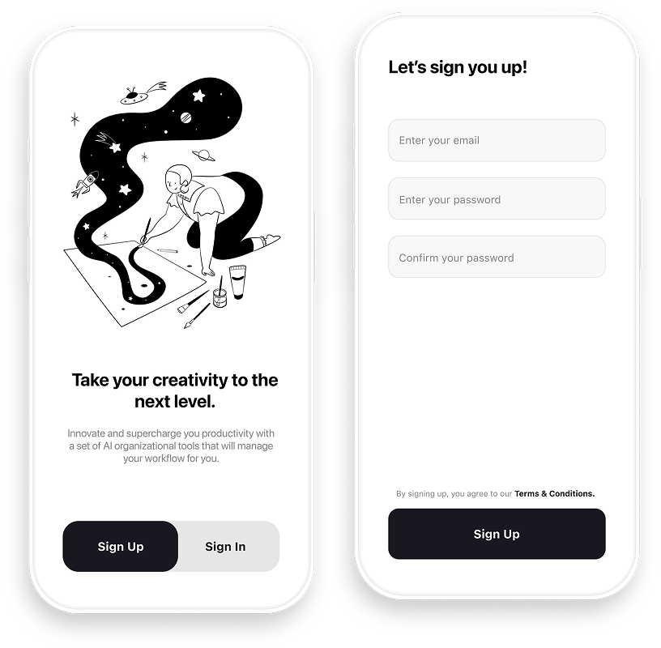

# Structure of Unit tests

Unit tests are responsible for testing individual methods and components of our application in isolation. Let's imagine that we developed an amount formatter for our application. It takes a `Decimal` value as an input and converts it into a formatted `String` amount:

```swift
final class AmountFormatter {

	/// Formats the `Double` value into a formatted `String` amount.
	///
	/// Example:
	/// 100 -> 100.00
	/// 1000 -> 1,000.00
	/// 1500000.50 -> 1,500,000.50
	///
	/// - Parameter value: the `Decimal` value to be converted.
	///
	/// - Returns: A formatted `String` amount.
	func formattedAmount(from value: Decimal) -> String {
		// ...
	}
}
```

In this example, we need to write unit tests that would validate that the formatting logic behaves as we expect it to.  Any unit test follows the following structure: *Arrange*, *Act*, *Assert*:

- *Arrange* is the step where we prepare the necessary dependencies and properties for our test;
- *Act* is the step where we perform the action that needs to be tested;
- *Assert* is the step where we validate that the result of our action matches the result that we expect;

For our example, we might want to test the following scenario:

```swift
// ARRANGE

let amountFormatter = AmountFormatter()

// ACT

let formattedAmount = amountFormatter.formattedAmount(from: 100)

// ASSERT

XCTAssertEqual(formattedAmount, "100.00")
```

Another common way of naming these steps is: *Given*, *When*, *Then* - and all unit tests must follow this structure.

<aside>
💬

The `XCTAssertEqual` is a syntax specific to `XCTest`, the native iOS unit testing framework. You don't have to worry about it right now, just know that this statement asserts if two values are equal or not.

</aside>

---

Let’s take a look at another example. In this one, we’ll take a look at a common use case that we mobile developers have to deal with a lot in our development process:



Most of us had to deal with some form of authentication at one phase or another in our development career. As part of our responsibility as mobile developers was to make sure that the information users pass via the required input fields are valid.

In other words, we need to validate the input from the *Email* and *Password* fields before users could tap the *Sign Up* button and send that information to the backend.

Let’s assume that for our *Email* field we needed to add the following validations:

- the email address must contain a @ symbol;
- the email address must contains a . symbol;
- the email address must have a maximum length of 64 characters;
- the email address must not start with a special character;

```swift
import Foundation

@Observable
final class LoginViewModel: LoginViewModelProtocol {

    // MARK: - Properties

    var email: String = ""
    var password: String = ""

    // MARK: - Getters

    var isEmailValid: Bool {
        email.contains("@") &&
        email.contains(".") &&
        email.count <= 64 &&
        email.isMatchingRegex("^[A-Za-z0-9]")
    }
}
```

Let’s add some unit tests to validate this implementation:

1. Validate that an email that does not contain the @ symbol is not valid:

```swift
// Given

let viewModel = LoginViewModel()
viewModel.email = "user.mail.com"

// When

let isEmailValid = viewModel.isEmailValid

// Then

XCTAssertFalse(isEmailValid)
```

1. Validate that an email that does not contain the .(dot) symbol is not valid:

```swift
// Given

let viewModel = LoginViewModel()
viewModel.email = "user@mail,com"

// When

let isEmailValid = viewModel.isEmailValid

// Then

XCTAssertFalse(isEmailValid)
```

1. Validate that an email that is longer than 64 characters is not valid:

```swift
// Given

let viewModel = LoginViewModel()
let address = String(repeating: "A", count: 65)
viewModel.email = "\(address)@mail.com"

// When

let isEmailValid = viewModel.isEmailValid

// Then

XCTAssertFalse(isEmailValid)
```

1. Validate that an email that starts with a symbol is not valid:

```swift
// Given

let viewModel = LoginViewModel()
viewModel.email = "!user@mail.com"

// When

let isEmailValid = viewModel.isEmailValid

// Then

XCTAssertFalse(isEmailValid)
```

Finally, we’ll add another unit test to validate that a correct email format is accepted:

```swift
// Given

let viewModel = LoginViewModel()
viewModel.email = "user@mail.com"

// When

let isEmailValid = viewModel.isEmailValid

// Then

XCTAssertTrue(isEmailValid)
```

By writing these test cases, we ensure that all of our validation requirements are being respected.

---

You might be wondering what is the purpose of these unit tests. Surely, we can implement the logic and test it manually ourselves. Why do we need to spend additional time writing test cases when we know for sure that the code works?

There are a lot of benefits to writing unit tests, but if we were to summarise the main idea, it would sound something like this:

<aside>
💡

Just because your code works now, it does not mean that it will continue to work in the future.

</aside>

As we mentioned in the introduction, software development is a constantly changing field. Features are added, functionalities and changed and components are removed. Things that worked in the past can easily break due to some unexpected change somewhere else.

These sort of bugs are called *regression bugs* - bugs that appear on old, previously working, features as a result of a new change. In this case, having a bunch of tests that validate our functionalities allows us to be confident that our code continues to work well.

Not only that, but unit tests allow us to find bugs immediately. Bugs are a normal part of software development, but there’s a huge difference between a bug during development and a bug in an application that is already released in the App Store. This is why unit tests are a core part of developing quality mobile applications.
