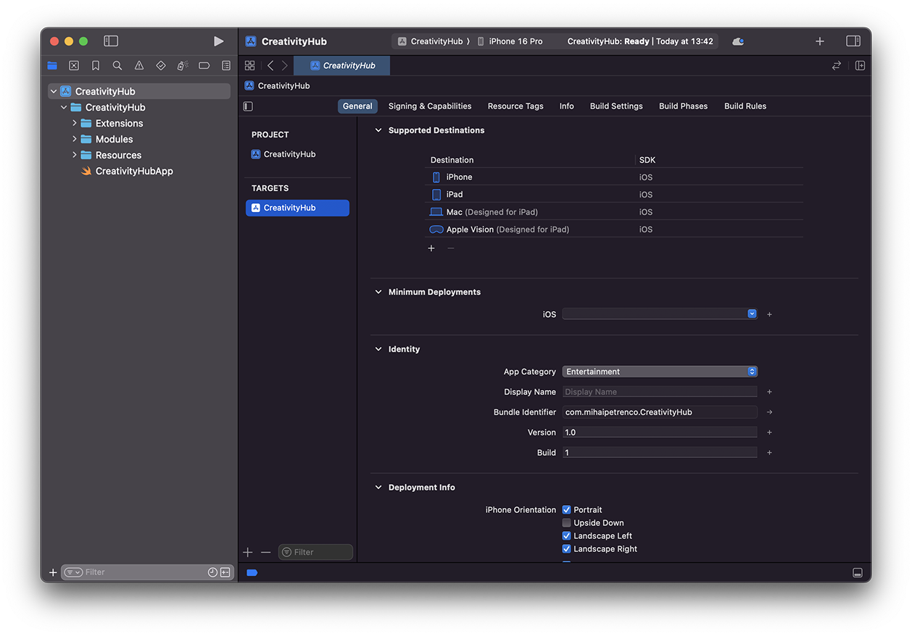
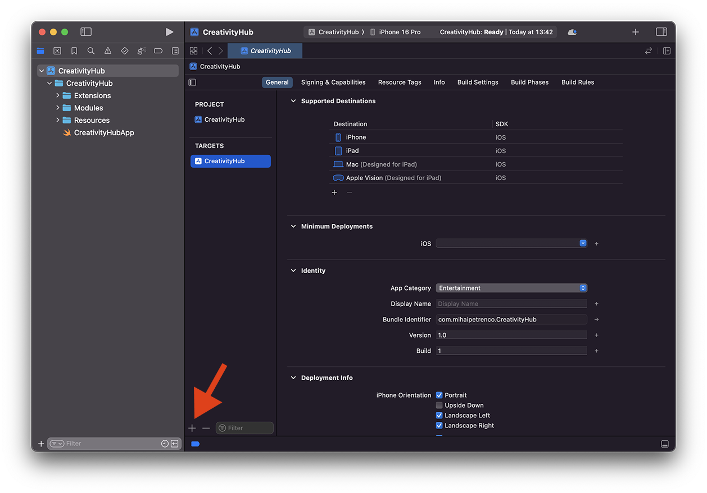
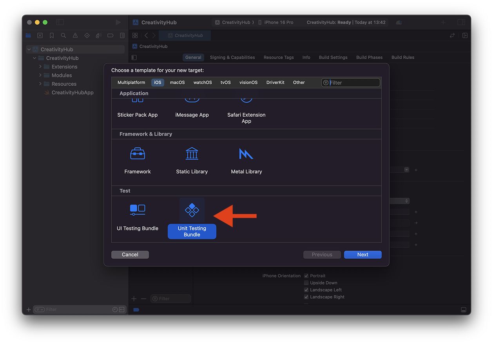
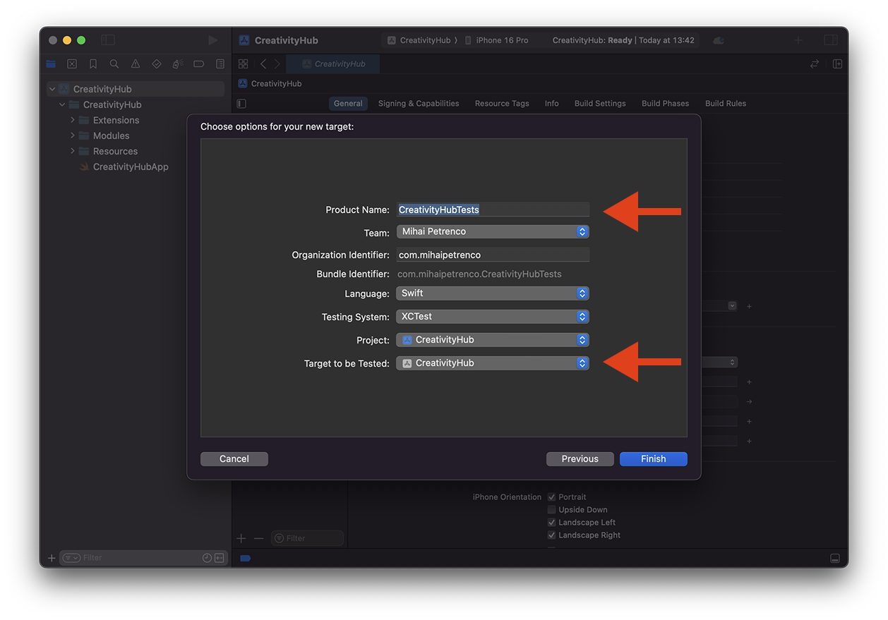
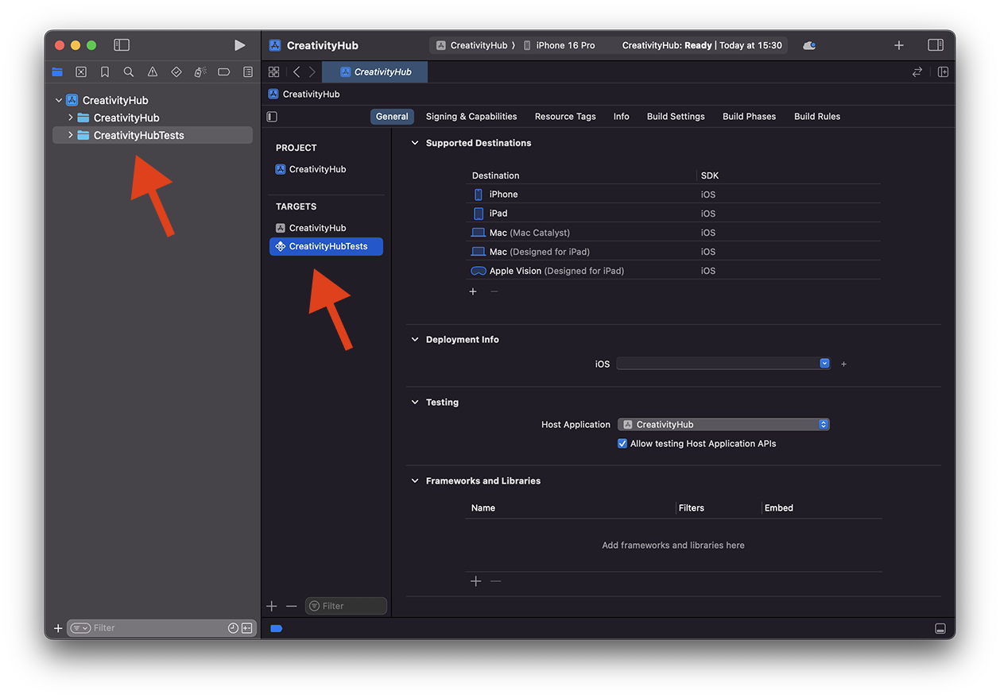
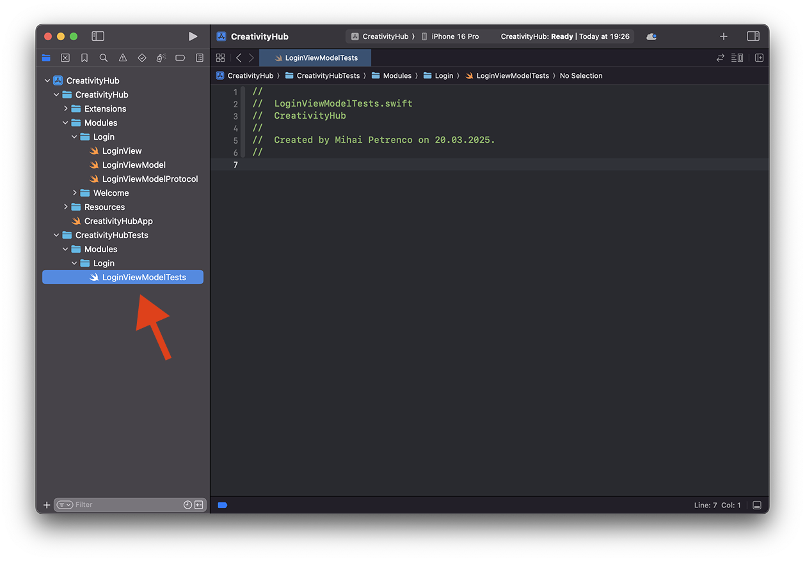

# Introducing XCTest

Now that we have a solid understanding of what unit tests are, as well as the benefits of writing them, let’s explore how to write unit tests in iOS using `XCTest` - Apple’s native testing framework.

---

# Adding a Unit Testing Target:

Let’s start by taking a look at a simple XCode project:



The project is called *CreativityHub*, a platform for artists to upload and share their artwork to the world. In fact, the *Login* feature that we looked at in the previous chapter is part of this project.

But that’s not really important for us. What is important is that this is a standard XCode project with a single target - `CreativityHub` - which represents our application.

To add unit testing capabilities to our application, we must start by creating a new unit testing target.



Tap on the `+` button at the bottom of the screen and a popup should appear, which will allow you to select a target template. Look for `Unit Testing Bundle`:



Once the template is selected, we must then add some information about our newly added target. Most of it is pretty straightforward. Pay attention to the `Product Name` and `Target to be Tested` fields.

- *Product Name* is the name of your new unit testing target. A typical naming convention is to add a “Tests” suffix at the end of the target to be tested. In other words, if you plan to test the `CreativityHub` target, the testing target will be named `CreativityHubTests`.

- *Target to be Tested* is, as the name suggests, the target that we want to cover with unit tests. In our case, we have only one target - our main app, but if we were to have multiple targets, we would have to make sure to point to the correct destination first.



Once everything is good, we tap on `Finish` to create our new target. We can now see that a new target was added to the list, as well as a new folder on the left side. This is where our test files will be added, as well as other test-specific helpers that we might need.



---

# Adding a Unit Test File:

Now that we have a unit testing target in place, let’s add some unit test files. In the previous chapter we took a look at how we could test the email field validation in our `LoginViewModel`, so let’s integrate this properly.

Create a new Swift file called `LoginViewModelTests`. It is a nice practice to mirror your test folder structure in a similar way to your development folders. In this example, since our `LoginViewModel` lives inside `Modules` → `Login`, we’re going to create our `LoginViewModelTests` in the same nested directory.

Also, feel free to delete the `CreativityHubTests` file that was automatically created for us, since we don’t actually need it. It’s mostly added as an example:



---

# Writing our first test case:

First of all, here’s how to declare a new test case:

```swift
// 1.
import XCTest

// 2.
@testable import CreativityHub

// 3.
final class LoginViewModelTests: XCTestCase {
}
```

1. We start by importing `XCTest`, the iOS framework for writing unit tests. This will give us access to all necessary methods and classes to be able to write our test cases.

1. We must also import our `CreativityHub` target, which is required to access our `LoginViewModel` that needs to be tested. Notice the `@testable` keyword added at the start. By default, only `public` or `open` components (properties, methods, classes, etc.) can be accessed outside of a model. This is great for encapsulation, but it makes our testing more difficult. Adding the `@testable` keyword basically gives us access to all non-`private` components, which is very convenient.

2. We create a new test class, called `LoginViewModelTests`. Note how our test class subclasses `XCTestCase`. This is a requirement - all our test cases must have this in order for them to work properly.

With our test class set up, let’s continue by writing our first test case:

```swift
import XCTest

@testable import CreativityHub

final class LoginViewModelTests: XCTestCase {

    @MainActor
    func test_givenEmailWithNoAtSymbol_whenIsEmailValidGet_thenReturnFalse() {

        // Given

        let sut = LoginViewModel()
        sut.email = "user.mail.com"

        // When

        let isEmailValid = sut.isEmailValid

        // Then

        XCTAssertFalse(isEmailValid)
    }
}
```

A test case is basically a function, but with some specific naming particularities. The naming convention is as follows:

- Every test function must start with `test`. This is how XCTest understands that this is a test case and not a normal function. This is the only requirement when it comes to naming test methods, the rest are simply conventions that are optional, but recommended.

- After that, function naming must follow the same *Given*, *When*, *Then* pattern. This allows us to easily understand what the test does and what it expects by reading the function name directly, which is useful when you have hundreds of tests.

To get the point across, here are a couple of examples:

```swift
// GIVEN: The API response is going to be successful
// WHEN:  We attempt to fetch users from the backend
// THEN:  The valid user list should be returned
func test_givenSuccessfulResponse_whenFetchingUsers_thenReturnUserList()

// GIVEN: The API response is going to fail
// WHEN:  We attempt to fetch users from the backend
// THEN:  The correct exception should be thrown
func test_givenFailedResponse_whenFetchingUsers_thenThrowCorrectException()

// GIVEN: The Email and Password fields are both valid
// WHEN:  We attempt to check the `isLoginEnabled` value
// THEN:  The result should be `true`
func test_givenEmailAndPasswordFieldsAreValid_whenIsLoginEnabledGet_thenReturnTrue()
```

<aside>
💬

You might have noticed that we named our `LoginViewModel` property as `sut`. This is a shorthand for *system under test*, and we typically use this convention to name the component that we’re about to test.

</aside>

<aside>
🎓

**Self-Assessment:**
Try to write the test cases for the other scenarios using correct naming.

</aside>

---

# Test Setup and Teardown

You might notice that for every single test case we have to initialize our `LoginViewModel`. Since it’s a single line of code, it’s not a big deal, but often we have to do larger code setups in the *Given* step. Doing this in every test case causes a lot of unnecessary duplication.

Let’s look at an example of this. The code itself doesn’t really matter that much, but pay attention at the duplication that we have to do for each test case:

```swift
final class TransactionViewModelTests: XCTestCase {

	func test_givenSuccessfulResponse_whenFetchingTransactions_thenReturnValidList() async throws {

		// Given

		let service = TransactionServiceMock()
		let router = RouterMock()

		let sut = TransactionViewModel(
			service: service,
			router: router
		)

		service.fetchTransactionsTask = Task {
			let mockedResponse = TransactionHistoryResponse()
			return mockedResponse.transactions
		}

		// When

		let transactions = try await = sut.onFetchTransaction()

		// Then

		XCTAssertFalse(transactions.isEmpty)
	}

	func test_givenFailedResponse_whenFetchingTransactions_thenThrowException() async {

		// Given

		let service = TransactionServiceMock()
		let router = RouterMock()

		let sut = TransactionViewModel(
			service: service,
			router: router
		)

		service.fetchTransactionsTask = Task {
			throw TransactionServiceError.invalidResponse
		}

		// When

		do {
			_ = try await sut.onFetchTransaction()
			XCTFail("Exception should be thrown for invalid API response.")
		} catch {

			// Then

			XCTAssertEqual(error as? TransactionServiceError, .invalidResponse)
		}
	}
}
```

I’ll give you a short overview of what we’re basically doing, but you shouldn’t worry if you don’t get it just yet. We’ll talk about mocking in the next chapter.

Basically, we have a `TransactionViewModel` which depends on a `TransactionService` and `Router` to work properly. We provide a `TransactionServiceMock` to be able to return fake responses instead of sending actual API requests.

In the first test case, we simulate a successful response which returns a list of transactions, while in the second, we simulate a failed scenario where an exception is thrown. Notice how in both test cases we have almost identical *Given* steps.

This is where test setup and teardown comes handy. Instead of declaring the same repeating logic in every test function, we have special functions called `setUp` and `tearDown` which run before and after each test case, and which we can use to put all of our setup logic.

With this in mind, let’s improve the code by adding these two methods and removing the duplication:

```swift
final class TransactionViewModelTests: XCTestCase {

	// MARK: - Properties

	private var service: TransactionServiceMock!
	private var router: Router!
	private var sut: TransactionViewModel!

	// MARK: - Test Setup

	override func setUp() async throws {
		try await super.setUp()
		service = TransactionServiceMock()
		router = RouterMock()
		sut = TransactionViewModel(
			service: service,
			router: router
		)
	}

	override func tearDown() async throws {
		service = nil
		router = nil
		sut = nil
		try await super.tearDown()
	}

	// MARK: - Test Cases

	func test_givenSuccessfulResponse_whenFetchingTransactions_thenReturnValidList() async throws {

		// Given

		service.fetchTransactionsTask = Task {
			let mockedResponse = TransactionHistoryResponse()
			return mockedResponse.transactions
		}

		// When

		let transactions = try await = sut.onFetchTransaction()

		// Then

		XCTAssertFalse(transactions.isEmpty)
	}

	func test_givenFailedResponse_whenFetchingTransactions_thenThrowException() async {

		// Given

		service.fetchTransactionsTask = Task {
			throw TransactionServiceError.invalidResponse
		}

		// When

		do {
			_ = try await sut.onFetchTransaction()
			XCTFail("Exception should be thrown for invalid API response.")
		} catch {

			// Then

			XCTAssertEqual(error as? TransactionServiceError, .invalidResponse)
		}
	}
}
```

Notice how we added two new methods to our test case and moved all of our duplicate initialization logic inside of it. The individual test methods are now cleaner, shorter and focus only on what matters.

Besides these two methods, we also have the `class` versions as well. Here’s the difference between them:

```swift
// Runs only once at the beginning of the test case.
override class func setUp() {}

// Runs before each test.
override func setUp() async throws {}

// Runs after each test.
override func tearDown() async throws {}

// Runs only once at the end, once all tests have been completed.
override class func tearDown() {}
```

The `class` version is not as commonly used, but it’s helpful to know that if need to set something that persists across all test functions, we have this option as well.

<aside>
💬

You might be wondering about the force unwrapped (`!`) properties, and if it isn’t a bad practice to use it. Theoretically, we could use optionals instead (`?`) when declaring our properties, but since `setUp` and `tearDown` is guaranteed to be called before and after each test method, we know for sure that our properties are going to be initialized before use.

At the end of the day, force unwrapping isn’t good or bad. It’s a language tool like any other. It is our job as engineers to use it responsibly.

</aside>

---

# Common Assertions:

Before moving on, let’s take a look at some common assertions offered by `XCTest`.

## Truth Assertions:

Validates that something is `true` or `false`.

```swift
XCTAssertTrue(isEmailValid)
XCTAssertNotTrue(isEmailValid)
```

## Nil Assertions:

Validates that something is `nil` or not.

```swift
XCTAssertNil(email)
XCTAssertNotNil(email)
```

## Equality Assertions:

Validates if two instances are equal or not.

```swift
XCTAssertEqual(country, “Moldova”)
XCTAssertNotEqual(userOne, userTwo)
```

## Error Assertions:

Validates if a method throws an exception or not.

```swift
XCTAssertThrowsError(try fetchUsers())
XCTAssertNoThrow(try updateAccountDetails())
```

With error assertions, we can also add an optional closure to capture the exact error being thrown. We can then use XCTAssertEqual to check if the error thrown matches the one that we expect:

```swift
XCTAssertThrowsError(try request()) { error in
	XCTAssertEqual(error as? ApiError, .invalidResponse)
}
```

## Failure Assertions:

Automatically fails the test.

```swift
XCTFail()
```

This can be combined with `if`, `guard` and `switch` statements to manually cause a test failure in case we encounter a behaviour that we do not expect.

<aside>
💬

Assertions also accept a second parameter of type `String`, which allows us to specify the reason of the test failure.

```swift
XCTAssertNotNil(fetchedUser, "User must not be nil for a valid request.")
```

</aside>
