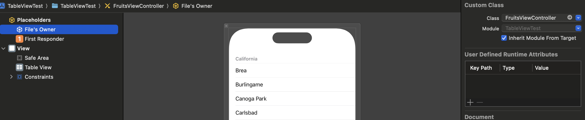

# More UIKit

## 1. Introduction to UITableView and UICollectionView in UIKit

**UITableView** and **UICollectionView** are vital for displaying **scrollable lists** or **grids** in iOS apps. They use **reusable cells** for performance:

- **UITableView**: Typically a **vertical, single-column list** (e.g., contacts, settings).
- **UICollectionView**: A **flexible, multi-column or custom layout** approach (e.g., grids, carousels).

Both rely on:

- **Data Source**: Provides the “what” – the number of items and how each cell is configured.
- **Delegate**: Provides the “how” – user interactions, selection, layout, etc.

---

## 2. How to Add These in a XIB

In this guide, we’ll create **two** example view controllers:

1. **`FruitsViewController`** with a **UITableView**.
2. **`ColorGridViewController`** with a **UICollectionView**.

### 2.1. Create a XIB + Swift Class for a Table View

1. In Xcode, **File → New → File from Template**
2. Under **iOS**, select **“Cocoa Touch Class”** (or “Swift File + XIB”).
3. Name it **`FruitsViewController`**. Make sure **Subclass of** is `UIViewController`.
4. Check **“Also create XIB”** if available. If not, create the `.xib` manually:
    - **File → New → File... → View** and name it `FruitsViewController.xib`.
5. Open `FruitsViewController.xib`.
    - Select the **top-level View**.
    - **Identity Inspector** → **Class** = `FruitsViewController`.

    


### 2.2. Drag a UITableView Onto the XIB

1. Search for **“Table View”** in the **Object Library**.
2. Drag it onto the main view.
3. Use **Auto Layout** constraints (pin top, left, right, bottom = 0) so it fills the screen.


### 2.3. Create an IBOutlet for the Table View

1. Open the Assistant Editor or Ctrl-drag from the Table View in the XIB to `FruitsViewController.swift`.
2. Create:

    ```swift
    @IBOutlet weak var tableView: UITableView!

    ```


### 2.4. Set a Reuse Identifier for the Prototype Cell

1. In the `viewDidLoad()`, register the **prototype cell** for the Table View.

    ```swift
    tableView.register(UITableViewCell.self, forCellReuseIdentifier: "FruitCell")

    ```


---

## 3. Configure These in Code

Now we’ll set up the **FruitsViewController** to show a list of fruits using **UITableView**.

**FruitsViewController.swift** might look like this:

```swift
import UIKit

class FruitsViewController: UIViewController {

    // 1) Connect the IBOutlet from the XIB
    @IBOutlet weak var tableView: UITableView!

    // 2) Create a sample data array
    private let fruits = ["Apple", "Banana", "Cherry", "Date", "Elderberry"]

    override func viewDidLoad() {
        super.viewDidLoad()

        // 3) Assign the data source and delegate
        tableView.dataSource = self
        tableView.delegate = self

        // 4) Set the reuseIdentifier for your cell
        tableView.register(UITableViewCell.self, forCellReuseIdentifier: "FruitCell")
    }
}

```

Here’s what we did:

1. **Added an IBOutlet** for the Table View.
2. **Created the fruits** array, so we actually have content to display.
3. **Assigned** `tableView.dataSource = self` and `tableView.delegate = self` so our view controller will supply data and handle user interactions.

---

## 4. How to Use Delegate and Data Source for Each

### 4.1. UITableView (Fruits Example)

We now **adopt** the **UITableViewDataSource** and **UITableViewDelegate** protocols in `FruitsViewController`:

```swift
extension FruitsViewController: UITableViewDataSource {
    // Tells how many rows to display in each section
    func tableView(_ tableView: UITableView, numberOfRowsInSection section: Int) -> Int {
        return fruits.count
    }

    // Creates (or reuses) and configures each cell
    func tableView(_ tableView: UITableView, cellForRowAt indexPath: IndexPath) -> UITableViewCell {
        // Dequeue using the reuse identifier we set in the XIB
        let cell = tableView.dequeueReusableCell(withIdentifier: "FruitCell", for: indexPath)
        cell.textLabel?.text = fruits[indexPath.row]
        return cell
    }
}

extension FruitsViewController: UITableViewDelegate {
    // Called when a user taps a row
    func tableView(_ tableView: UITableView, didSelectRowAt indexPath: IndexPath) {
        print("Selected fruit:", fruits[indexPath.row])
        tableView.deselectRow(at: indexPath, animated: true)
    }
}

```

- **Data Source**:
    - `numberOfRowsInSection`: The count is `fruits.count`.
    - `cellForRowAt`: Dequeues a reusable cell named `"FruitCell"` and sets the label to `fruits[indexPath.row]`.
- **Delegate**:
    - `didSelectRowAt`: Handles user taps. Here, we simply print the selected fruit.

**Result**: A functional table showing our **fruits** list.


---

### 4.2. UICollectionView (Color Example)

We’ll create another view controller named **`ColorGridViewController`** for a grid of colored cells.

### Add the .xib + Swift Class

1. **File → New → File from Template**
2. **Cocoa Touch Class**, name it `ColorGridViewController`, from `UIViewController` template.
3. Open `ColorGridViewController.xib`, select the top-level view → set **Class** to `ColorGridViewController`.

### Drag a UICollectionView

1. In the XIB, search “Collection View.”
2. Drag it to the main view. Pin edges with constraints..

### Create IBOutlet

```swift
@IBOutlet weak var collectionView: UICollectionView!

```

### Configure in `viewDidLoad()`

```swift
import UIKit

class ColorGridViewController: UIViewController {

    @IBOutlet weak var collectionView: UICollectionView!

    // For demonstration: an array of UIColors
    private let colors: [UIColor] = [
        .systemRed, .systemBlue, .systemGreen,
        .systemOrange, .systemPurple, .systemYellow,
        .brown, .magenta, .cyan
    ]

    override func viewDidLoad() {
        super.viewDidLoad()

        // Assign data source & delegate
        collectionView.dataSource = self
        collectionView.delegate = self

        // Register the dequeue cell
        collectionView.register(UICollectionViewCell.self, forCellWithReuseIdentifier: "ColorCell")
    }
}

```

### Adopt Data Source & Delegate

```swift
extension ColorGridViewController: UICollectionViewDataSource {
    // Number of items
    func collectionView(_ collectionView: UICollectionView, numberOfItemsInSection section: Int) -> Int {
        return colors.count
    }

    // Create/reuse each cell
    func collectionView(_ collectionView: UICollectionView, cellForItemAt indexPath: IndexPath) -> UICollectionViewCell {
        let cell = collectionView.dequeueReusableCell(withReuseIdentifier: "ColorCell", for: indexPath)
        cell.backgroundColor = colors[indexPath.item]
        return cell
    }
}

extension ColorGridViewController: UICollectionViewDelegate {
    // Called when user taps a cell
    func collectionView(_ collectionView: UICollectionView, didSelectItemAt indexPath: IndexPath) {
        print("Tapped color at index:", indexPath.item)
    }
}

```

**Now** you have a **basic** collection view that displays colored cells.


---

## 5. How to Create Custom Cells

### 5.1. Custom UITableViewCell

If you want a row to show, say, an **image** and a **label**, you can create a separate XIB for the cell:

1. **File → New → File... → Cocoa Touch Class**
    - Subclass **`UITableViewCell`**, name it `FruitTableViewCell`.
    - Check **“Also create XIB”** if possible, or create the XIB separately.
2. **In `FruitTableViewCell.xib`:**
    - Click the top-level cell. In the Identity Inspector, set **Class** = `FruitTableViewCell`.
    - Place a **UILabel** and an **UIImageView** in the cell.
    - Create IBOutlets in `FruitTableViewCell.swift`:

        ```swift
        @IBOutlet weak var fruitImageView: UIImageView!
        @IBOutlet weak var fruitNameLabel: UILabel!

        ```

    - Set the **reuseIdentifier** to `"FruitCell"` in the Attributes Inspector.
3. **In `FruitsViewController.viewDidLoad()`**, you can register this XIB if you’re not using the same XIB prototype cell:

    ```swift
    let nib = UINib(nibName: "FruitTableViewCell", bundle: nil)
    tableView.register(nib, forCellReuseIdentifier: "FruitCell")

    ```

4. **Use it** in `cellForRowAt`:

    ```swift
    func tableView(_ tableView: UITableView, cellForRowAt indexPath: IndexPath) -> UITableViewCell {
        let cell = tableView.dequeueReusableCell(withIdentifier: "FruitCell", for: indexPath) as! FruitTableViewCell
        cell.fruitNameLabel.text = fruits[indexPath.row]
        // cell.fruitImageView.image = ...
        return cell
    }

    ```


### 5.2. Custom UICollectionViewCell

Similar approach:

- Subclass `UICollectionViewCell`.
- Create a XIB.
- Add UI elements (label, image, etc.), link IBOutlets.
- Register or use a prototype cell with that custom class/reuse ID.

---

## 6. Custom Collection Layouts

**UICollectionView** supports:

1. **Flow Layout + Delegate**: A standard grid or list that you can tweak (row spacing, item spacing, item size, etc.).
    - Implement `UICollectionViewDelegateFlowLayout`:

        ```swift
        extension ColorGridViewController: UICollectionViewDelegateFlowLayout {
            func collectionView(_ collectionView: UICollectionView,
                                layout collectionViewLayout: UICollectionViewLayout,
                                sizeForItemAt indexPath: IndexPath) -> CGSize {
                let spacing: CGFloat = 10
                let totalWidth = collectionView.bounds.width
                let itemWidth = (totalWidth - spacing) / 2
                return CGSize(width: itemWidth, height: itemWidth)
            }
        }

        ```

    - This achieves a **2-column** layout with minimal code.
2. **Fully Custom Layout**: Subclass `UICollectionViewLayout` or `UICollectionViewFlowLayout` to create advanced designs (like Pinterest-style masonry).

For most scenarios, a flow layout with delegate methods is enough.

---

## 7. Conclusion

Following these steps, you can:

1. **Add a UITableView or UICollectionView** into a XIB.
2. **Connect them** via IBOutlets and set the reuse identifier in the prototype cell.
3. **Configure them in code** by assigning `dataSource` and `delegate`.
4. **Implement the necessary methods** for each protocol:
    - **UITableViewDataSource** / **UITableViewDelegate**
    - **UICollectionViewDataSource** / **UICollectionViewDelegate**
5. **Create custom cells** when you need more than a simple label.
6. **Customize layouts** in UICollectionView, either with flow layout or a custom approach.

With this knowledge, you can build **scrollable, high-performance lists and grids** in your iOS apps. Whether you need a simple table of fruits or a dynamic 2-column gallery, **UITableView** and **UICollectionView** are powerful foundations to get the job done!

### 8. Homework

- Implement the UI for the *Browse* and Favorites screen;
- *Browse* should use a 2-column *UICollectionView*;
- *Favorites* should use a *UITableView*;
